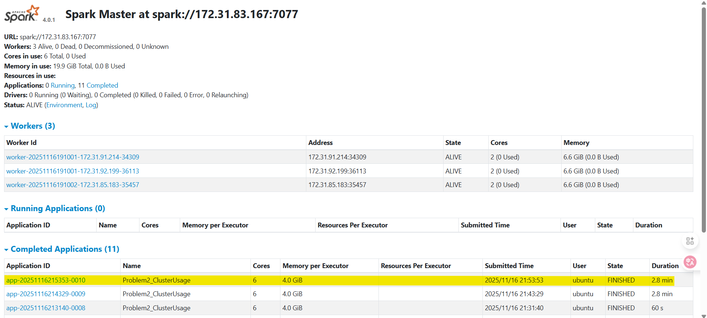
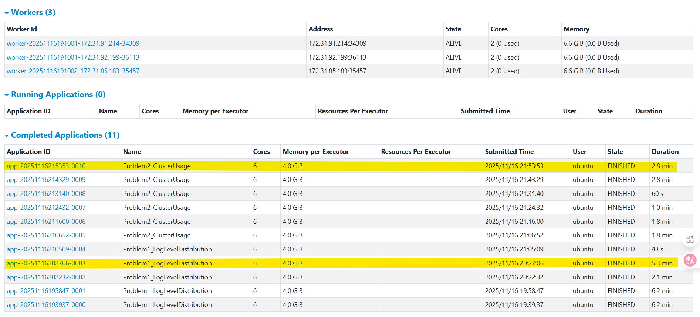
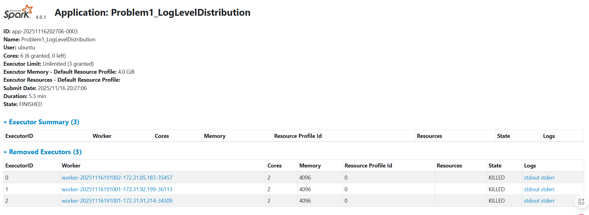
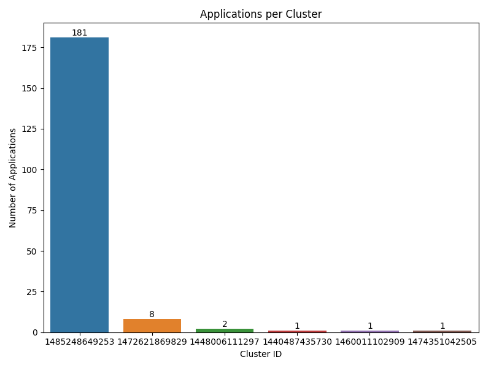
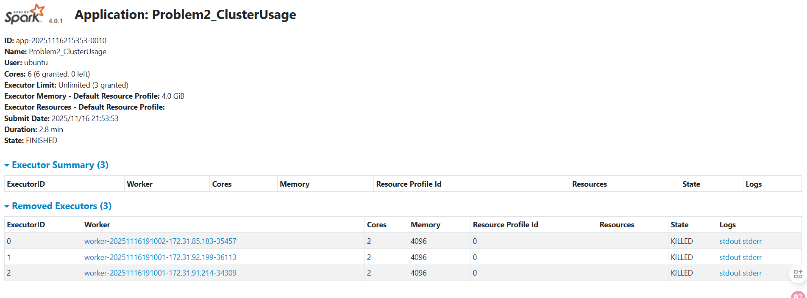

# Analysis Report

## Problem 1

### Approach

The goal was to process all application log files stored in S3 and compute basic log statistics. I first created a Spark session on the cluster and used a text list of all log paths to load the data. The parsing step extracted the timestamp and the log level from each line using regular expressions. Since Spark writes CSV results as folders, I kept the data movement on the driver side and wrote the summary files directly using Python. This avoided problems with empty part files and kept the outputs simple.

### Key results

The dataset contained more than 33 million log lines.
About 27.4 million lines included a recognized log level. The distribution was dominated by INFO logs.

```
INFO   27389482  
ERROR     11259  
WARN       9595
```

Almost all messages were informational. Error and warning rates were very low. This shows that the applications generally ran without major issues and there were no clusters with obvious systemic failures.

### Performance notes

Running Problem 1 on the Spark cluster took around 5 minutes. The job used all available cores. The main cost was scanning many log files on S3. The parsing itself was simple and scaled well. Once the data was loaded, the grouping operation finished quickly.







The Spark Web UI confirmed that the job used one executor per worker with two cores each. The workload was mostly I O bound due to S3 reads.

---

## Problem 2

### Approach

Problem 2 focused on analyzing when each application started and ended, grouped by cluster. I reused the same S3 log paths and parsed the timestamp and the application ID from the filename. The application ID gave both the cluster identifier and the application number.

To handle inconsistent timestamp lines, I used a safer two step method. First I extracted a raw timestamp string. Then I converted only non empty strings into real timestamps. This helped avoid parsing errors and handled logs with missing prefixes.

The timeline for each application was computed using the min and max timestamps. I collected the results to the driver to compute summaries and generate the visualizations.

### Key findings

There were 6 clusters in total.
A total of 194 applications were detected.

One cluster stood out:

```
Cluster 1485248649253: 181 applications
```

The remaining clusters had only one to eight applications each. This shows that real workload was almost entirely concentrated in a single cluster. It likely represents the large training job that produced most of the logs in the dataset.

The average job count per cluster was about 32 but this average is influenced by the skew. Most clusters barely ran anything.

### Visualization explanations

#### Bar chart



The bar chart shows the number of applications per cluster. Since cluster `1485248649253` had the overwhelming majority of applications, it dominates the chart. The other clusters appear as small bars. Colors were assigned by cluster ID. This makes it easier to distinguish clusters even if their job counts are small.

#### Duration distribution


The second plot shows job duration (in seconds, on a log scale) for the busiest cluster. The distribution has a clear center around several hundred to a few thousand seconds. The log scale reveals that the distribution is long tailed. Most jobs fall into a middle band but a few jobs are much shorter or much longer.

This matches the behavior of typical Spark applications that consist of many task batches, each taking variable time depending on data size and stage transitions.

### Performance notes



Problem 2 completed in around 2.8 minutes based on the Spark Web UI. The job was lighter than Problem 1 because it involved only a few group by operations and reading timestamps. Collecting the grouped data to the driver was acceptable because the number of applications is under two hundred. Converting timestamps and writing charts had negligible cost.
